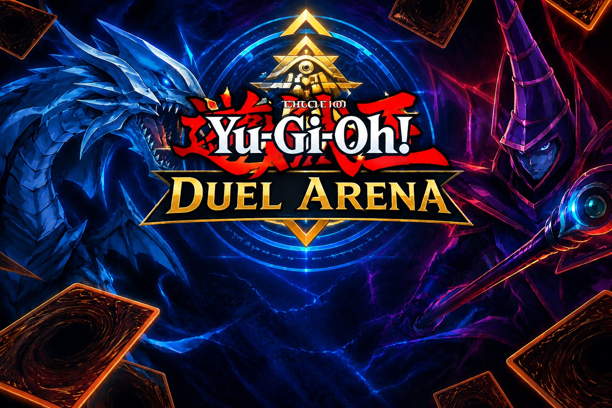

# Yu-Gi-Oh! Duel Arena

Aplicación de escritorio en **Java Swing** que simula un duelo de cartas Yu-Gi-Oh! entre el jugador y la **IA**.
Las cartas Monster se obtienen al azar y en vivo desde la API de [YGOProDeck](https://ygoprodeck.com/api-guide/).
Gana el duelo quien llegue primero a **2 rondas**.

| | |
|---|---|
| **Autor** | Kevin Steven Posso Sanchez |
| **Código** | 2380636-2724 |
| **Grupo** | 52 |
| **Institución** | Universidad del Valle, Sede Tuluá |
| **Programa** | Tecnología en Sistemas |
| **Materia** | Desarrollo de Software III – Laboratorio #1 |
| **Docente** | Mg(c). Juan Pablo Pinillos Reina |

## Requisitos
- JDK 11 o superior (el proyecto compila con `maven.compiler.release` = 11).
- Maven 3.6+ (IntelliJ IDEA ya incluye uno integrado).
- Conexión a internet: las cartas y sus imágenes se descargan al iniciar cada duelo.
- Única dependencia externa: `org.json:json:20240303` (Maven la descarga sola).

## Ejecución

### IntelliJ IDEA
1. `File > Open` → seleccionar el archivo `pom.xml` → **Open as Project**.
2. Esperar a que Maven descargue las dependencias (si no arranca solo: pestaña *Maven* → botón *Reload All Maven Projects*).
3. Verificar que el JDK del proyecto sea 11 o superior (`File > Project Structure > Project`).
4. Abrir `src/main/java/java/Main.java` y ejecutar con el triángulo verde junto a `main`.

Alternativa con Maven desde IntelliJ: pestaña *Maven* → *Plugins* → `exec` → doble clic en `exec:java`.
Si creas una configuración de ejecución *Maven*, en el campo **Run** escribe exactamente `compile exec:java`
**sin comentarios ni otro texto**; un `#` hace que Maven falle con *Unknown lifecycle phase "#"*.

### Línea de comandos
```bash
mvn compile exec:java
```
Jar ejecutable con todas las dependencias:
```bash
mvn package
java -jar target/yugioh-duel-arena-1.0.0.jar
```

## Uso
1. **Menú inicial:** pulsa **Iniciar** para entrar al duelo o **Salir** para cerrar la aplicación.
2. **Carga:** la app descarga 6 cartas (3 para ti y 3 para la IA) y muestra el progreso "Cargando cartas n/6".
3. Cuando estén listas, pulsa **Iniciar duelo**.
4. En cada ronda elige una carta, su posición (**Atacar** o **Defender**) y pulsa **Elegir carta**.
5. La IA elige carta y posición al azar. Su carta se revela al resolverse la ronda y el resultado queda en el registro.
6. Al llegar a 2 puntos se anuncia el ganador del duelo.

Botones de la pantalla de juego:
- **Iniciar duelo**: comienza el duelo con las cartas cargadas.
- **Revancha**: repite el duelo con las mismas 6 cartas y el marcador en 0, sin volver a consultar la API.
- **Cargar nuevas cartas**: descarga 6 cartas nuevas (también sirve para reintentar tras un error).
- **Cómo jugar**: muestra las reglas en una ventana.

Disponibilidad de los botones según el estado:

| Estado | Iniciar duelo | Revancha | Cargar nuevas cartas | Cómo jugar |
|---|---|---|---|---|
| Cargando cartas | no | no | no | sí |
| Cartas listas | sí | no | sí | sí |
| Duelo en curso | no | no | no | sí |
| Duelo terminado | no | sí | sí | sí |
| Error de carga | no | no | sí | sí |

Ayudas de la interfaz:
- Al elegir Atacar/Defender se resalta el valor que contará (ATK en dorado, DEF en azul).
- Tras cada ronda, las cartas jugadas se marcan en verde (ganó) o rojo (perdió) y bajo el marcador aparece el detalle del resultado.
- El estado indica "Ronda N de 3" y cuántas rondas se necesitan para ganar.
- Al terminar el duelo se revelan las cartas que no se jugaron.
- El campo de batalla del fondo (Basic, Extra o Pendulum) cambia en cada carga de cartas; la revancha conserva el mismo.
- La ventana se limita al área útil de la pantalla para no quedar cortada en portátiles o con escalado de Windows.

## Reglas del duelo
Cada bando tiene 3 cartas Monster y cada carta se usa una sola vez. Se juegan hasta 3 rondas y gana quien consiga 2.

| Situación | Gana |
|---|---|
| Ambas en ATAQUE | Mayor ATK |
| Ambas en DEFENSA | Mayor DEF |
| Una ataca y la otra defiende | El atacante solo si su ATK es **mayor** que el DEF del defensor; si no, gana el defensor |
| Empate exacto (misma posición y mismo valor) | Desempate aleatorio, indicado en el registro |

Decisiones sobre puntos que el enunciado no define:
- La posición del jugador la elige él; la de la IA es aleatoria.
- Se descartan y se vuelven a pedir las cartas que no son Monster, que no tienen ATK/DEF (por ejemplo, los Link Monsters) o que no tienen imagen. Máximo 5 intentos por carta.
- El "turno inicial" se sortea al comenzar el duelo, se alterna cada ronda y se anuncia en el registro. La IA mantiene su carta oculta hasta resolver la ronda.

## Arquitectura
Paquete base `edu.univalle.yugioh`, con las responsabilidades separadas:

| Paquete | Clases | Responsabilidad |
|---|---|---|
| (raíz) | `Main` | Punto de entrada: abre el menú inicial en el hilo de eventos de Swing. |
| `model` | `Card`, `Position` | Datos de la carta (nombre, ATK, DEF, URL e imagen) y posición (ATAQUE/DEFENSA). |
| `api` | `YgoApiClient`, `YgoApiException` | Consulta a YGOProDeck con `java.net.http.HttpClient` y parseo con `org.json`. Valida que la carta sea Monster con ATK/DEF e imagen y descarga cada imagen una sola vez. |
| `logic` | `Duel` | Reglas y estado del duelo, **sin dependencias de Swing**. |
| `listener` | `BattleListener` | Eventos del duelo: `onTurn`, `onScoreChanged`, `onDuelEnded`. |
| `ui` | `StartMenu`, `MainFrame`, `CardPanel` | Menú inicial, ventana de juego (implementa `BattleListener`) y vista de cada carta. |

Puntos de diseño:
- `Duel` no conoce la interfaz: notifica a los `BattleListener` registrados y `MainFrame` los usa para actualizar el registro, el marcador y las cartas reveladas.
- La interfaz no se bloquea: la descarga de datos e imágenes se hace en un `SwingWorker` que publica el progreso al hilo de eventos (EDT).
- Los botones usan `ActionListener`. Los errores ("No se pudo cargar la carta", "Error de red") se muestran en la etiqueta de estado, en el registro y en un diálogo.
- `MainFrame` controla qué botones están habilitados con un estado de pantalla (inactivo, cargando, listo, en curso, terminado, error).
- `randomcard.php` redirige a `cardinfo.php?num=1&offset=0&sort=random`, por eso el cliente HTTP sigue redirecciones.

### Estructura del proyecto
```
yugioh-duel-arena/
├── pom.xml
├── README.md
├── .gitignore
└── src/main/
    ├── java/edu/univalle/yugioh/
    │   ├── Main.java
    │   ├── api/        YgoApiClient, YgoApiException
    │   ├── listener/   BattleListener
    │   ├── logic/      Duel
    │   ├── model/      Card, Position
    │   └── ui/         StartMenu, MainFrame, CardPanel
    └── resources/assets/ui/
        ├── menu-background.jpg
        ├── deck.png
        ├── field-basic.png, field-extra.png, field-pendulum.png
        └── life-point-counter.png, life-point-counter-enemy.png, life-point-numbers.png
```

## Recursos gráficos
Se cargan desde el classpath (`/assets/ui/`) mediante `MainFrame.loadImage`.

| Archivo | Uso |
|---|---|
| `menu-background.jpg` | Portada del menú inicial. |
| `deck.png` | Dorso de las cartas ocultas de la IA. |
| `field-basic.png`, `field-extra.png`, `field-pendulum.png` | Fondo de la mesa de juego (uno al azar por carga de cartas). |
| `life-point-counter.png`, `life-point-counter-enemy.png` | Contadores de puntos del jugador y de la IA. |
| `life-point-numbers.png` | Sprite de dígitos que se dibuja dentro de los contadores. |

Las imágenes de las cartas no forman parte del proyecto: se descargan de YGOProDeck durante la ejecución.
Yu-Gi-Oh! y sus personajes son propiedad de sus respectivos dueños; este proyecto es un trabajo académico sin fines comerciales.

## Capturas de pantalla
- 
- ![Carga de cartas ] 
- ![Duelo en curso ] 
- ![Mensaje de error de red ] 
- ![Ganador final ] 
